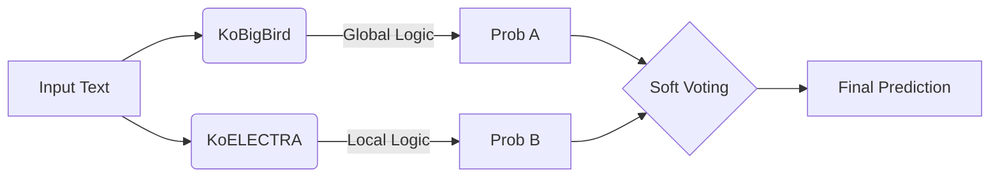

# LLM-Generated Text Detection

> **생성 AI(LLM)가 작성한 텍스트와 인간이 작성한 텍스트를 판별하는 이진 분류 프로젝트**

[](https://www.python.org/)
[](https://pytorch.org/)
[](https://huggingface.co/)

## 1. Problem Overview 📋

뉴스 및 문서 형태의 장문 텍스트가 "인간에 의해 작성되었는지" 아니면 "생성형 AI 모델에 의해 작성되었는지"를 판별하는 과제입니다.

* **Input:** 뉴스/문서 형태의 장문 텍스트 (문서 길이 편차가 큼)
* **Key Challenge:** 국소적인 문법 오류보다는 **전반적인 문서 구조, 반복 패턴, 서술 흐름** 파악이 핵심
* **Metric:** ROC-AUC

---

## 2. Approach & Strategy 

### 2.1 Baseline: TF-IDF + XGBoost
초기에는 통계적 접근 방식을 시도했으나, 생성 AI 텍스트의 특성(확률적 패턴, 긴 문맥)을 포착하는 데 한계를 확인했습니다.

* **Structure:** `[Title TF-IDF] + [Full Text TF-IDF]` → `FeatureUnion` → `XGBoost`
* **Limitation:** 단어 빈도(n-gram) 기반 특징은 문맥 정보를 손실하며, 긴 호흡의 생성 패턴을 인식하기 어려움.

### 2.2 Transition to Transformers
단순 키워드 매칭이 아닌 **"문서 전반의 생성 패턴 인식"** 문제로 재정의하여 Transformer 기반 모델로 전환했습니다.

* **Focus:** 전체 본문(`full_text`) 활용
* **Problem Type:** `Regression` (Binary Classification이지만 Logit 값을 그대로 활용하여 AUC 최적화)
* **Validation:** Stratified K-Fold (5-fold)

---

## 3. Model Architecture 

서로 다른 Inductive Bias를 가진 두 가지 모델을 사용하여 앙상블 효과를 극대화했습니다.

###  Model 1: KoBigBird (Global Context)
* **Role:** Long-Sequence Modeling (문서 전체의 구조 및 흐름 파악)
* **Why?** 일반 BERT(512 토큰 제한)로는 긴 문서의 후반부 문맥이 손실됨. Sparse Attention을 통해 긴 시퀀스(1024) 처리.
* **Focus:** 서술 구조, 반복 패턴, 전역적(Global) 특징

| Setting | Value |
| :--- | :--- |
| **Model** | `monologg/kobigbird-bert-base` |
| **Max Length** | 1024 |
| **Epochs** | 3 |
| **Learning Rate** | 2e-5 |

###  Model 2: KoELECTRA (Local Pattern)
* **Role:** Token-level Discrimination (국소적 이상 패턴 감지)
* **Why?** ELECTRA는 "이 토큰이 자연스러운가?"를 판별하도록 학습됨. AI 텍스트 특유의 어색한 연결이나 확률 분포 포착에 유리.
* **Focus:** 짧은 문맥에서의 정밀한 판별, 국소적(Local) 특징

| Setting | Value |
| :--- | :--- |
| **Model** | `monologg/koelectra-base-v3-discriminator` |
| **Max Length** | 256 |
| **Epochs** | 3 |

---
## 4. Ensemble Strategy 

**Soft Voting Ensemble**을 통해 Global 특징과 Local 특징을 결합하였습니다.



### Ensemble Logic
| Model | Viewpoint | Inductive Bias |
| :--- | :--- | :--- |
| **KoBigBird** | Macro (거시적) | 문서 전체 구조, 긴 호흡의 서술 패턴 |
| **KoELECTRA** | Micro (미시적) | 토큰 단위의 자연스러움, 국소적 이상치 |

$$\text{Final Probability} = \frac{\text{Prob}_{\text{BigBird}} + \text{Prob}_{\text{Electra}}}{2}$$

---

## 5. Experiment Environment 🛠️

### Hardware & Platform
* **Platform:** Google Colab
* **GPU:** NVIDIA GPU (CUDA 11.8)

### Installation
Reproducibility를 위한 라이브러리 설정입니다.

```bash
# Torch Environment Setup
pip uninstall -y torch torchvision torchaudio
pip install torch==2.1.2 torchvision==0.16.2 torchaudio==2.1.2 \
  --index-url [https://download.pytorch.org/whl/cu118](https://download.pytorch.org/whl/cu118)

# Model Requirements
pip install transformers==4.38.2 accelerate peft datasets
```

---

## 6. Results & Key Takeaways 

### Performance
* **Rank:** Top 26% (72 / 271 Teams) - *Private Leaderboard*
* **Metric:** ROC-AUC

### Insights
1.  **Pattern over Meaning:** 생성 AI 판별은 텍스트의 의미를 이해하는 것보다 생성 패턴(Generation Artifacts)을 인식하는 것이 중요합니다.
2.  **Length Matters:** 긴 문서에서는 512 토큰을 넘어서는 정보를 처리하는 Long-sequence 모델(BigBird)이 유의미한 성능 향상을 가져왔습니다.
3.  **Synergy of Views:** 거시적 관점(BigBird)과 미시적 관점(ELECTRA)을 결합한 앙상블 전략이 단일 모델보다 효과적이었습니다.
4.  **Regression Framing:** Classification 문제를 Regression으로 접근하여 Logit 값을 활용한 것이 AUC 지표 학습에 안정적이었습니다.

---

👉 대회 진행하면서 정리해둔 NOTION LINK
* https://www.notion.so/223ff0f0c4c98005ac0aeac60d9fe902?v=223ff0f0c4c9810795a7000c3da7e52f&source=copy_link
